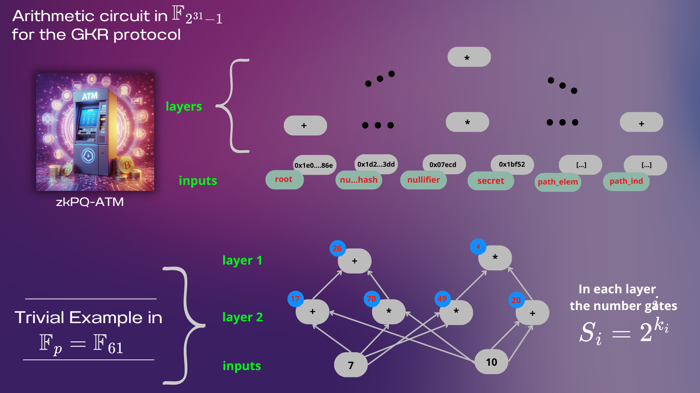
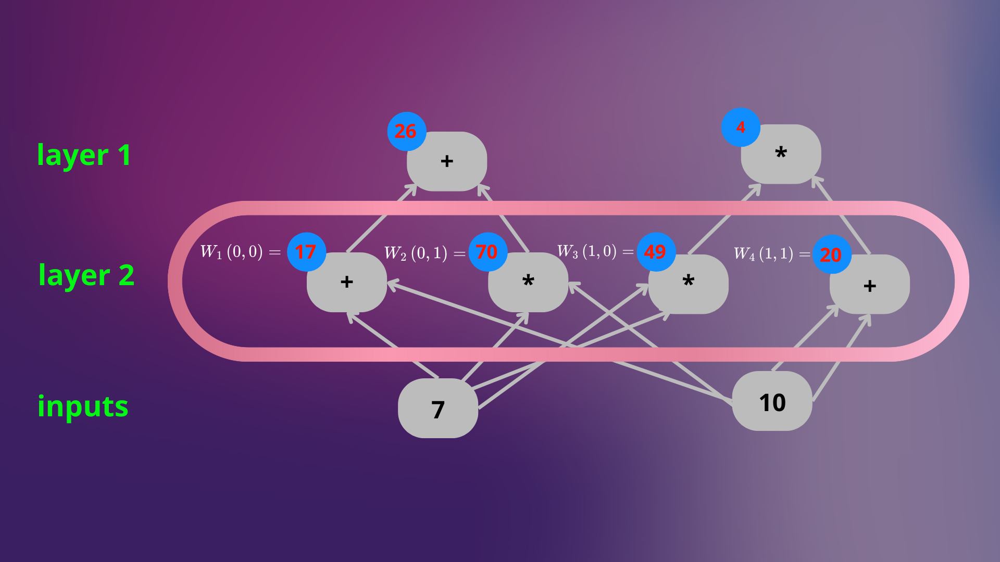
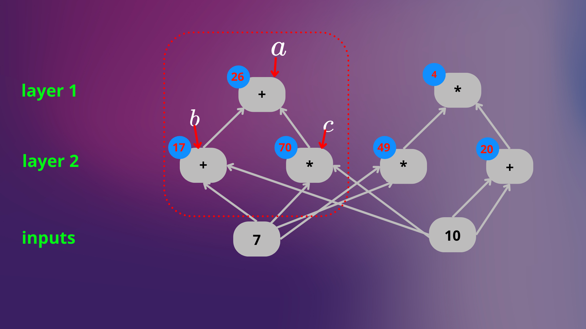

## GKR from Scratch for zkPQ-ATM
The GKR (Goldwasser-Kalai-Rothblum) protocol is a powerful tool in the realm of zero-knowledge proofs, designed to efficiently verify computations in arithmetic circuits. Its innovative approach allows a verifier with limited resources to check the correctness of complex computations without needing to run the entire circuit, making it ideal for systems where scalability and efficiency are critical.

### How does the GKR protocol work?
Instead of evaluating each gate and each layer of the circuit independently, the GKR protocol leverages the algebraic structure of the problem to recursively verify computations. It uses the sumcheck protocol to validate partial sums representing the value computed at each layer of the circuit. This recursive approach dramatically reduces the computational burden, as the verifier only needs to interact with a small portion of the circuit at each step, rather than committing to all intermediate results.

### Purpose of this document
In this document, we will explore how the GKR protocol can be applied to a specific circuit within the Expander framework. Through a practical example, we will describe step-by-step how the protocol works, how it integrates with the circuit, and how it can be implemented to improve the efficiency of zero-knowledge proofs.

## GKR Protocol

We will approach the GKR protocol from a practical perspective, starting by describing the type of computation we wish to prove. Although the GKR protocol is inherently interactive, it is important to note that it can be made non-interactive using the Fiat-Shamir transform, a technique widely used in zero-knowledge proof systems to eliminate the need for interaction between the prover and the verifier.

We will work on the M31 field, a finite field defined as $F_{2^{31} - 1}$. This field is especially efficient for implementations on 64-bit architectures, since its size (31 bits) allows to take full advantage of native CPU operations, resulting in fast and optimized computations. One of the key advantages of M31 is its fast modular arithmetic, which simplifies operations such as additions, multiplications, and reductions, which is crucial to ensure efficiency in complex arithmetic circuits.

M31 is not only efficient, but also ideal for ensuring the correctness of in-circuit calculations, as its algebraic structure allows for verifications to be performed accurately and without loss of performance. This makes it an excellent choice for systems requiring high performance and security, as is the case with zkPQ-ATM.

In addition to M31, Expander supports two other main fields [View Fields in Expander](https://github.com/PolyhedraZK/ExpanderCompilerCollection/tree/4989db69573cbbed8f57549b31abf7857146286a/ecgo/field), each with its own advantages and use cases: 
- BN254: This field is a standard in Ethereum and is optimal for pairing-based schemes. With a size of ~254 bits, BN254 is widely used in cryptographic applications that require blockchain compatibility and advanced operations such as BLS signatures.
- GF2: This binary field is ideal for boolean circuits, where operations are performed in bit arithmetic. GF2 is especially useful in applications requiring boolean logic verifications or calculations in binary systems.

The choice of M31 for this project is due to its unique balance between efficiency and ease of implementation, making it perfect for arithmetic circuits in zero-knowledge proof systems like the GKR protocol.

---------------------------------------

Figure 1: Our arithmetic circuit is in $\mathbb{F}_{2^{31}-1}$ for the GKR protocol, but we show examples for $\mathbb{F}_{61}$

---------------------------------------

### The rover (Peggy) shares the results to the verifier (Expander contract)

1. Peggy sends the Expander verifier the asserted values ​​as the outputs of the circuit. These values ​​are sent in the form of a function $D: \{0,1\}^{k_i} \rightarrow \mathbb{F}_{61}$. As in this trivial example $k_i = 0$, Peggy sends the linear polynomial that satisfies: $$D(0)= 26, D(1)= 4.$$
2. One of the most important components of interactive protocols is randomness. The Expander verifier picks a random point $r_0 \in \mathbb{F}^{k_0}$ and sends it to Peggy who must incorporate this point into her calculations. This avoids any attempt to fool the Expander verifier. For example: $$r_0 = 5.$$
3. Both Peggy and Expander compute $\overline{D}(r_0)$, where $\overline{D}(x)$ is the multilinear extension of $D$. This is the unique multilinear polynomial over $\mathbb{F}_p$ satisfying: $$\overline{D}(r_0) = f(x), x \in \{0,1\}^l.$$

This $f(x)$ is a $l$-variant polynomial over $\mathbb{F}_{p}$, where $\overline{D}(x)$ matches $D(x)$ on all boolean-valued inputs. If it does not match on a single input, the extension will differ at almost all points outside the original domain. This is a consequence of the Schwartz-Zippel lemma, which states that the probability of choosing a zero of a polynomial at random is negligible for a sufficiently large field.

Using Lagrange interpolation, we have: $$\overline{f}(x_1,...,x_l) = \sum_{w\in {0,1}^l}^{} f(w) \chi_w(x_1,...,x_l)$$ where $\chi_w$ are the (multilinear) Lagrange basis polynomials: $$\chi_w(x_1,...,x_l) = \prod_{i=1}^{l}(x_i \cdot w_i + (1 - x_i)(1- w_i)).$$

In our example, since we have $k_i = 0$, it is satisfied that:
$$\overline{D}(x) = D(0) \cdot (x \cdot 0 + (1 - x)(1-0)) + D(1) \cdot (x \cdot 1 + (1 - x)(1-1))$$
$$ = D(0) \cdot (1-x) + D(1) \cdot  1 $$
$$ = 26(1-x) + 4 $$

Thus:
$$\overline{D}(r_0) = \overline{D}(5) = -100 \equiv 39 \mod(61).$$

Now, we can see that verifying the program's outputs comes down to checking that: $\overline{D}(r_0) = 39$

For each layer $i$ of the circuit, we will denote to be $W_i$ the function that maps a node’s position to its actual value, let 
$\overline{W}_i(x)$ be its multilinear extension. $$W_i : \{0,1\}^{k_i} \rightarrow \mathbb{F}_{p}$$

---------------------------------------

Figure 2: The verifier’s task can be seen as checking that ${D}(x) = W_i(0)$

---------------------------------------

By the Schwartz-Zippel lemma, it suffices to check that $$\overline{D}(r_0) = \overline{W}_0(r_0).$$

Please note that the verifier cannot directly access $W(x)$.

## Modeling the circuit

The goal is to verify that the sum of many terms (corresponding to a node's computed value) equals $\overline{D}(r_0) = \overline{W}_0(r_0) = 39$, use the sum-check protocol:

1. Addition Function: The function $Add$ marks all the addition nodes in layer $i$. Take as input $x \in {0,1}^{k_i + 2k_{i+1}}$, which encodes the position $a$ of an add node in the current layer, together with the positions $b$ and $c$ of the two nodes in the next layer to which it is connected. The function $Add_i$ is defined as 1 when $x=(a,b,c)$ corresponds to a valid add node with the appropriate inputs, and zero otherwise.

---------------------------------------

Figure 3: The output addition node is at position: $a : (0)$ and is connected to nodes: $b : (0, 0)$,  $c : (0, 1)$.

---------------------------------------

Since this is the only addition node, we define the function:

| $Add_1(x)$ | Condition                     |
|------------|-------------------------------|
| 1          | si $x = (0,0,0,0,1)$          |
| 0          | en otro caso                  |

We then extend this function to a multilinear polynomial, denoted $Add_i(x)$: $$\overline{Add}_1(x_1, x_2, x_3, x_4, x_5) = (1-x_1 )\cdot (1-x_2) \cdot (1-x_3) \cdot (1-x_4) \cdot x_5.$$

2. Multiplication Function: For the Multiplication node in our first layer.

| $Mul_1(x)$ | Condition                     |
|------------|-------------------------------|
| 1          | si $x = (1,1,0,1,1)$          |
| 0          | en otro caso                  |

Its multilinear extension is given by: $$\overline{Mul}_1(x_1, x_2, x_3, x_4, x_5) = x_1 \cdot x_2 \cdot (1-x_3) \cdot x_4 \cdot x_5.$$

Finally, we need to connect these two new functions. To do this, we can define a function that “calculates” the value of a node in layer $i$ given the values ​​in the next layer: $$f_i(a,b,c) = \overline{Add}_i(a,b,c) \cdot (\overline{W}_{i+1}(b) + \overline{W}_{i+1}(c)) + \overline{Mul}_i \cdot (\overline{W}_{i+1}(b) \cdot \overline{W}_{i+1}(c)).$$

In our first layer: 
$$f_i(0,0,0,0,1) = 26$$
$$f_i(1,1,0,1,1) = 4$$

 Fijamos $(a = r)$, donde $r$ el punto aleatorio dado por el verificador, y sumamos sobre todas las asignaciones binarias posibles para $b$ y $c$. Con esto, obtenemos: $$\sum_{(b,c) \in \{0,1\}^{2k_i}}^{} \overline{f}_i = (r,b,c) = \overline{W}(r).$$

As we wanted to verify $\overline{D}(r_0) = \overline{W}(r_0)$, with the new function $\overline{f}$ and the random point $r_0$, we can think this as: $$\sum_{(b,c) \in \{0,1\}^{2k_i}}^{} \overline{f}_0 = (r_0,b,c) = \overline{W}(r_0)$$

## Sum-check

## Recursion