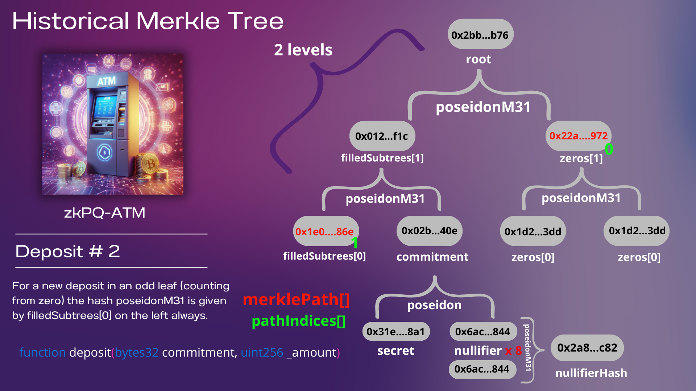

# zkPQ-ATM: Zero-Knowledge PostQuantum ATM

## Overview
zkPQ-ATM is a privacy-focused transaction system implemented using zero-knowledge proofs (ZKPs). Conceptually similar to Tornado Cash, it allows users to make deposits and withdrawals without revealing the connection between them, providing strong financial privacy on public blockchains. The project stands out for its use of Expander, a highly efficient proof system that achieves linear time complexity with respect to the size of the circuit. Expander leverages advanced cryptographic protocols like sumcheck GKR and HyperPlonk to enable fast proof generation and verification, making it ideal for scalable privacy solutions.

---------------------------------------


---------------------------------------



---------------------------------------


---------------------------------------


## Project Structure
```
zkPQ-ATM/
├── contracts/
│   └── zkPQ-ATM.sol       # Main Solidity smart contract (in progress)
└── expander/
    └── circuits/
        ├── merkleTree.circom  # Merkle tree implementation (circom)
        ├── withdraw.circom    # Withdrawal circuit implementation (circom)
        ├── withdraw_rs/       # Rust implementation using Expander
        └── withdraw_go/       # Go implementation using Expander
```

## Additional documentation
- *[GKR from Scratch for zkPQ-ATM](GKR-zkPQ-ATM.md)*

## How It Works

### Core Privacy Mechanism
The system uses zero-knowledge proofs to allow users to withdraw funds without revealing which deposit they're claiming:

1. **Deposit**:
- User generates a secret and a nullifier (private values)
- User computes a commitment (hash of secret & nullifier)
- User deposits funds along with the commitment
- The commitment is added to a Merkle tree

2. **Withdrawal**:
- User generates a zero-knowledge proof demonstrating:
    - They know a secret and nullifier that hash to a commitment in the Merkle tree
    - They know the Merkle path for this commitment
- User reveals the nullifier hash (but not the nullifier itself)
- Contract verifies the proof and records the nullifier hash to prevent double spending
- If valid, funds are released to the specified address

3. **Privacy Guarantee**:
- The link between deposits and withdrawals is broken
- No one can determine which deposit corresponds to which withdrawal

## Technical Implementation

### Zero-Knowledge Circuits (Expander)
- **withdraw_rs/main.rs**: Main circuit that verifies:
- Proper construction of the commitment
- Correctness of the Merkle proof
- Proper derivation of the nullifier hash
- Implements the verification of Merkle inclusion proofs

### Implementation Approaches
The project includes two separate implementations:

1. **Rust Implementation** (withdraw_rs):
- Built using the Expander framework
- Handles proof generation and verification

2. **Go Implementation** (withdraw_go):
- Alternative implementation using the gnark framework
- Provides another approach to the same zero-knowledge system

### Cryptographic Components
- **Poseidon Hash Function**: Used for commitment and nullifier hash generation
- **Merkle Tree**: Binary tree structure for efficiently proving inclusion of commitments
- **Zero-Knowledge Proofs**: Allows verification of claims without revealing underlying data

## Main Contribution: GKR Sumcheck Protocol

The major contribution of this project is the implementation of the GKR sumcheck protocol using the Expander library. This protocol allows for efficient proof generation and verification, which is crucial for scalable privacy systems on blockchains.


1. GKR Protocol Flow:

1. Generating proofs using sumcheck in the context of zkPQ-ATM:

2. Verifying proofs in the context of zkPQ-ATM:

### Integration with Expander:

Diagram showing how Expander simplifies the implementation of the GKR protocol.

## Challenges and Issues

1. Circuit compilation errors
Issue: During the initial stages, the circuit compilation process often failed due to the deletion of the `dev` branch on which several dependencies existed.

Solution: We created a PR with adjustments to the dependencies and configuration which was approved. [See PR #82](https://github.com/PolyhedraZK/ExpanderCompilerCollection/pull/82).

2. During the integration of the custom circuit with Expander, difficulties arose in obtaining variable values ​​at runtime. Builder.constant_value and builder.display were attempted, but they did not work as expected. The suggested solution was to use debug_eval in debug mode to inspect the values.

```rust
debug_eval(&Circuit::default(), &assignment, hint_registry);
```

3. After updating the library with cargo update, an error appeared when trying to run the circuit, specifically when calling the flatten function. The error indicated that the configuration type (GKRConfig) could not be inferred. The solution was to provide explicit type annotations:

```rust
let mut expander_circuit = compile_result
    .layered_circuit
    .export_to_expander::<C::DefaultGKRFieldConfig>()
    .flatten::<Cfg>();
```